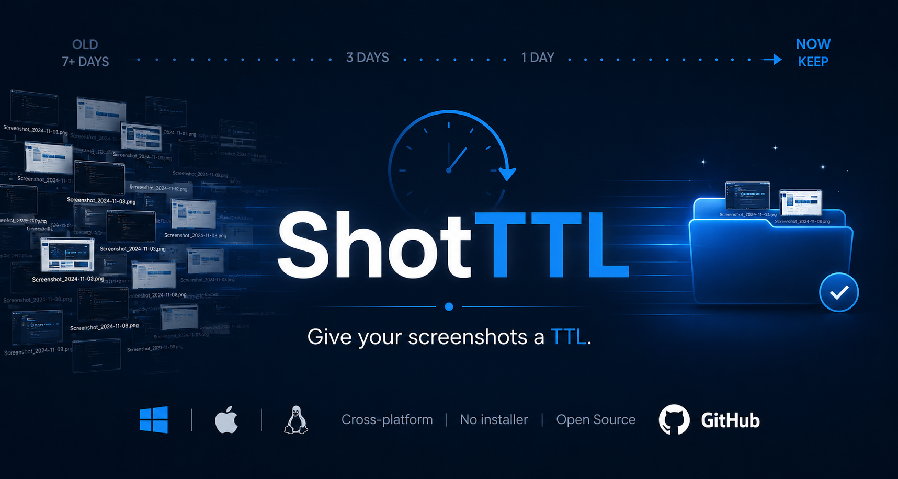
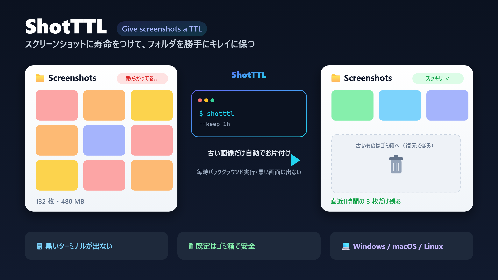
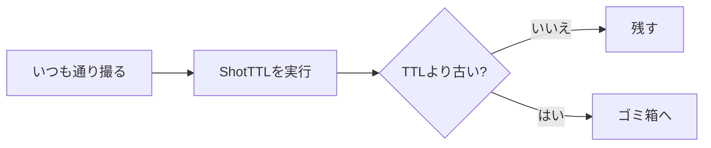

# ShotTTL

[English README](README.md)

スクリーンショットに寿命をつける。

<p align="center">
  
</p>

ShotTTL は、スクリーンショットフォルダが散らかり続けるのを防ぐ小さなツールです。残したい期間を指定してスクリプトを実行すると、古いスクリーンショットをゴミ箱へ移動します。

スクリーンショットを撮るツールではありません。Snipping Tool、macOS標準スクリーンショット、GNOME Screenshot、Flameshot など、今使っている撮影ツールはそのまま使えます。

<p align="center">
  
</p>

## 使うとどうなるか

いつも通りスクリーンショットを撮ります。

```text
Pictures/Screenshots/
  09-12-error.png
  09-18-before-fix.png
  10-03-after-fix.png
  last-week-random.png
```

まずは dry-run で確認します。

```bash
./scripts/unix/shotttl.sh --target "$HOME/Pictures/Screenshots" --keep 24h --dry-run
```

消える候補だけが表示されます。

```text
Would remove: /Users/you/Pictures/Screenshots/last-week-random.png
ShotTTL dry-run completed.
Candidates: 1
Would free: 2.4 MB
No files were deleted.
```

問題なさそうなら `--dry-run` を外します。

```bash
./scripts/unix/shotttl.sh --target "$HOME/Pictures/Screenshots" --keep 24h
```

デフォルトでは古いスクリーンショットがゴミ箱へ移動され、最近のスクリーンショットはそのまま残ります。



## クイックスタート

インストーラーなし。常駐アプリなし。アカウント作成なし。スクリプトを実行するだけです。

### Windows

まずは安全に確認します。

```powershell
.\scripts\windows\shotttl.ps1 -RetentionMinutes 60 -DryRun
```

実際に整理します。デフォルトはゴミ箱への移動です。

```powershell
.\scripts\windows\shotttl.ps1 -RetentionMinutes 60
```

### macOS / Linux

まずは安全に確認します。

```bash
./scripts/unix/shotttl.sh --target "$HOME/Pictures/Screenshots" --keep 24h --dry-run
```

実際に整理します。デフォルトはゴミ箱への移動です。

```bash
./scripts/unix/shotttl.sh --target "$HOME/Pictures/Screenshots" --keep 24h
```

## AI エージェントで自動セットアップ

AI コーディングエージェント（Claude Code / Codex / Cursor など）を使っているなら、セットアップを丸ごと任せられます。このリポジトリをクローンし、**ShotTTL フォルダの中で**エージェントを起動して、以下のプロンプトを貼り付けてください。OS を自動判定し、まず安全な dry-run を実行してから定期実行を設定します。

```text
このリポジトリの ShotTTL を使って、スクリーンショットフォルダを自動で整理する設定をして。

1. 私の OS（Windows / macOS / Linux）を判定する。
2. スクリーンショットフォルダを特定する。不明なら先に私に確認する。
3. まず保持期間 24h で dry-run を実行し、消える候補を見せる。
4. 私が確認したら、1時間ごとに Trash モード（明示的に指示しない限り完全削除はしない）で
   実行されるようスケジュール登録する。OS に応じたガイドに従うこと:
   - Windows: タスクスケジューラ + scripts/windows/run-hidden.vbs（docs/task-scheduler-windows.md）
   - Linux:   cron（docs/cron-linux.md）
   - macOS:   launchd LaunchAgent（docs/launchd-macos.md）
5. 登録したスケジュールの内容と、解除するコマンドを教える。

安全第一: Trash モードのみ、実削除の前に必ず確認、スクリーンショットフォルダ以外には触れないこと。
```

プロンプトに一言足すだけで、いずれも調整できます。

- 保持期間: 「保持期間は60分で」
- 削除方式: 「Trash ではなく完全削除で」
- 実行タイミング: 「30分ごとに実行」「毎日9時に1回」「8時〜20時の間だけ実行」

タイミングを指定しなければ、エージェントは1時間ごとの実行で登録します。

## 何が便利か

- 必要な期間のスクリーンショットだけを残せる
- AI エージェントやバグ報告で増えたスクショをまとめて整理できる
- 古い画像を手で選んで消す作業を減らせる
- dry-run で確認してから実行できる
- デフォルトはゴミ箱、完全削除は明示指定時だけ
- Windows / macOS / Linux で使える
- PowerShell と Bash の読めるスクリプトだけで動く

## よくある使い方

直近1時間だけ残す:

```powershell
.\scripts\windows\shotttl.ps1 -RetentionMinutes 60
```

直近24時間だけ残す:

```bash
./scripts/unix/shotttl.sh --target "$HOME/Pictures/Screenshots" --keep 24h
```

7日より古いものを消す前に確認する:

```bash
./scripts/unix/shotttl.sh --target "$HOME/Pictures/Screenshots" --keep 7d --dry-run
```

Windows で PowerShell の黒い画面を出さずに実行する:

```text
wscript.exe .\scripts\windows\run-hidden.vbs -RetentionMinutes 60
```

保持時間や対象フォルダも同じように指定できます。

例:

```text
wscript.exe .\scripts\windows\run-hidden.vbs -TargetDir "C:\Users\you\Pictures\Screenshots" -RetentionMinutes 1440
```

タスクスケジューラで動かす場合は、**Program/script** に以下を指定します。

```text
wscript.exe
```

**Add arguments** には以下を指定します。

```text
"C:\path\to\ShotTTL\scripts\windows\run-hidden.vbs" -RetentionMinutes 60
```

## 対象ファイル

ShotTTL は以下の画像ファイルだけを対象にします。

```text
.png  .jpg  .jpeg  .webp  .bmp  .gif
```

整理対象かどうかは、ファイルの最終更新時刻で判定します。指定した TTL より古いファイルだけが候補になります。

## 安全設計

ShotTTL は削除系ツールなので、安全側に倒しています。

- デフォルトは Trash モードです。
- 完全削除は `-DeleteMode Delete` または `--delete` 指定時だけです。
- 実行前に dry-run で対象を確認できます。
- ホームフォルダ、Desktop、Downloads、Documents、Pictures など広すぎるフォルダは拒否します。
- Windows では Hidden/System ファイルをスキップします。
- macOS / Linux ではドットファイルと隠しディレクトリ配下をスキップします。
- サブフォルダは明示指定時だけ対象にします。
- Linux ではゴミ箱コマンドが無い場合、勝手に `rm` へフォールバックしません。

## オプション

### Windows

```powershell
.\scripts\windows\shotttl.ps1 `
  -TargetDir "$env:USERPROFILE\Pictures\Screenshots" `
  -RetentionMinutes 1440 `
  -DeleteMode Trash
```

- `-TargetDir`: 整理対象のスクリーンショットフォルダ。省略時はよく使われるスクショフォルダを自動検出します。
- `-RetentionMinutes`: この分数以内に更新されたファイルを残します。デフォルトは `1440`。
- `-DeleteMode`: `Trash` または `Delete`。デフォルトは `Trash`。
- `-DryRun`: ファイルを消さず、対象候補だけを表示・ログ出力します。
- `-IncludeSubfolders`: サブフォルダも対象にします。デフォルトは無効。
- `-Quiet`: 標準出力を減らします。ログは残ります。
- `-CreateTargetIfMissing`: 対象フォルダが存在しない場合に作成します。
- `-Help`: ヘルプを表示します。

### macOS / Linux

```bash
./scripts/unix/shotttl.sh \
  --target "$HOME/Pictures/Screenshots" \
  --keep 24h \
  --trash
```

- `--target PATH`: 整理対象のスクリーンショットフォルダ。省略時はスクショ専用フォルダを自動検出します。
- `--keep 30m|1h|24h|7d`: 指定期間以内に更新されたファイルを残します。
- `--retention-minutes MIN`: 分単位で保持時間を指定します。デフォルトは `1440`。
- `--trash`: 古い画像をゴミ箱へ移動します。デフォルト。
- `--delete`: 古い画像を完全削除します。
- `--dry-run`: ファイルを消さず、対象候補だけを表示・ログ出力します。
- `--include-subfolders`: サブフォルダも対象にします。デフォルトは無効。
- `--quiet`: 標準出力を減らします。ログは残ります。
- `--help`: ヘルプを表示します。

## ログ

Windows:

```text
%APPDATA%\ShotTTL\logs\shotttl_yyyyMMdd.log
```

macOS / Linux:

```text
~/.shotttl/logs/shotttl_yyyyMMdd.log
```

ログには、実行日時、対象フォルダ、保持時間、削除方式、dry-run 状態、対象ファイル、失敗理由、件数、合計サイズが残ります。

## 自動実行

手動でも使えますし、定期実行もできます。

- [Windows Task Scheduler](docs/task-scheduler-windows.md)
- [Linux cron](docs/cron-linux.md)
- [macOS launchd](docs/launchd-macos.md)

## 公開情報

GitHub Description:

```text
Give your screenshots a TTL. A tiny cross-platform screenshot folder cleaner that keeps only recent screenshots and safely sweeps the rest.
```

推奨 GitHub Topics:

```text
screenshot screenshots cleanup cleaner ttl powershell bash windows macos linux oss developer-tools ai-tools claude-code codex
```

## ライセンス

MIT License. See [LICENSE](LICENSE).
