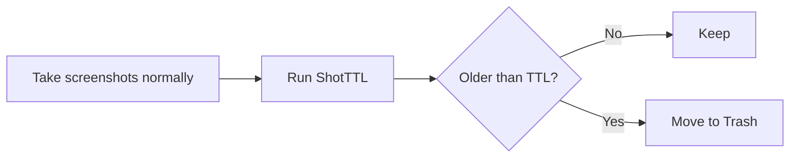

# ShotTTL

[日本語版 README](README.ja.md)

Give your screenshots a TTL.

<p align="center">
  
</p>

ShotTTL keeps your screenshot folder from turning into a junk drawer. Tell it how long screenshots should live, run one small script, and old screenshots go to the Trash.

It does not replace your screenshot tool. Keep using Snipping Tool, macOS screenshots, GNOME Screenshot, Flameshot, or whatever you already use.

## What It Feels Like

You take screenshots as usual:

```text
Pictures/Screenshots/
  09-12-error.png
  09-18-before-fix.png
  10-03-after-fix.png
  last-week-random.png
```

Then you run ShotTTL:

```bash
./scripts/unix/shotttl.sh --target "$HOME/Pictures/Screenshots" --keep 24h --dry-run
```

It shows what would be cleaned:

```text
Would remove: /Users/you/Pictures/Screenshots/last-week-random.png
ShotTTL dry-run completed.
Candidates: 1
Would free: 2.4 MB
No files were deleted.
```

When it looks right, run it without `--dry-run`:

```bash
./scripts/unix/shotttl.sh --target "$HOME/Pictures/Screenshots" --keep 24h
```

Old screenshots are moved to the Trash by default. Recent screenshots stay where they are.



## Quick Start

No installer. No background service. No account. Just scripts.

### Windows

Try it safely first:

```powershell
.\scripts\windows\shotttl.ps1 -RetentionMinutes 60 -DryRun
```

Clean with the default Trash mode:

```powershell
.\scripts\windows\shotttl.ps1 -RetentionMinutes 60
```

### macOS / Linux

Try it safely first:

```bash
./scripts/unix/shotttl.sh --target "$HOME/Pictures/Screenshots" --keep 24h --dry-run
```

Clean with the default Trash mode:

```bash
./scripts/unix/shotttl.sh --target "$HOME/Pictures/Screenshots" --keep 24h
```

## Set It Up With an AI Agent

If you use an AI coding agent (Claude Code, Codex, Cursor, etc.), you can let it do the whole setup. Clone this repo, open your agent **inside the ShotTTL folder**, and paste the prompt below. It auto-detects your OS, runs a safe dry-run first, and then schedules ShotTTL for you.

```text
Set up ShotTTL in this repo to clean my screenshots folder automatically.

1. Detect my OS (Windows, macOS, or Linux).
2. Find my screenshots folder. If you are not sure, ask me before continuing.
3. Run a dry-run first with 24h retention and show me what would be removed.
4. After I confirm, schedule ShotTTL to run every hour in Trash mode
   (never permanent delete unless I explicitly ask). Use the matching guide:
   - Windows: Task Scheduler via scripts/windows/run-hidden.vbs (docs/task-scheduler-windows.md)
   - Linux:   cron (docs/cron-linux.md)
   - macOS:   launchd LaunchAgent (docs/launchd-macos.md)
5. Tell me the exact schedule you created and the command to remove it.

Stay safe: Trash mode only, confirm before any real deletion, and never touch
any folder other than my screenshots folder.
```

You can tune any of this by adding a line to the prompt:

- Retention: "use a 60 minute retention"
- Delete mode: "use permanent delete instead of Trash"
- Schedule timing: "run every 30 minutes", "run once a day at 9am", or "only run between 8am and 8pm"

If you say nothing about timing, the agent schedules an hourly run.

## Why Use It

- Keep only screenshots that still matter
- Clean up screenshots from AI-agent or bug-report workflows
- Avoid manually selecting old images
- Start with dry-run, then clean for real
- Trash first; permanent delete only when explicitly requested
- Works on Windows, macOS, and Linux
- Plain readable scripts: PowerShell, Bash, and a small optional VBS helper

## Common Setups

Keep the last hour of screenshots:

```powershell
.\scripts\windows\shotttl.ps1 -RetentionMinutes 60
```

Keep the last 24 hours:

```bash
./scripts/unix/shotttl.sh --target "$HOME/Pictures/Screenshots" --keep 24h
```

Preview a weekly cleanup:

```bash
./scripts/unix/shotttl.sh --target "$HOME/Pictures/Screenshots" --keep 7d --dry-run
```

Run on Windows without a visible PowerShell window:

```text
wscript.exe .\scripts\windows\run-hidden.vbs -RetentionMinutes 60
```

You can pass the usual Windows options after `run-hidden.vbs`:

```text
wscript.exe .\scripts\windows\run-hidden.vbs -TargetDir "C:\Users\you\Pictures\Screenshots" -RetentionMinutes 1440
```

In Task Scheduler, set **Program/script** to:

```text
wscript.exe
```

Set **Add arguments** to:

```text
"C:\path\to\ShotTTL\scripts\windows\run-hidden.vbs" -RetentionMinutes 60
```

## What Gets Cleaned

ShotTTL only targets image files:

```text
.png  .jpg  .jpeg  .webp  .bmp  .gif
```

It uses each file's modification time. If the file is older than the TTL you choose, it becomes a cleanup candidate.

## Safety

ShotTTL is intentionally conservative:

- Trash mode is the default.
- Permanent deletion only happens with `-DeleteMode Delete` or `--delete`.
- Dry-run is available before every real cleanup.
- Broad folders such as the home folder, Desktop, Downloads, Documents, and Pictures are refused.
- Hidden/system files are skipped on Windows.
- Dotfiles are skipped on macOS / Linux.
- Subfolders are excluded unless explicitly requested.
- On Linux, Trash mode never falls back to `rm` when no supported trash command is available.

## Options

### Windows

```powershell
.\scripts\windows\shotttl.ps1 `
  -TargetDir "$env:USERPROFILE\Pictures\Screenshots" `
  -RetentionMinutes 1440 `
  -DeleteMode Trash
```

- `-TargetDir`: screenshot folder to clean. When omitted, ShotTTL tries common screenshot folders.
- `-RetentionMinutes`: keep files modified within this many minutes. Default: `1440`.
- `-DeleteMode`: `Trash` or `Delete`. Default: `Trash`.
- `-DryRun`: print and log candidates without removing files.
- `-IncludeSubfolders`: include files in child folders. Default: off.
- `-Quiet`: reduce console output while still writing logs.
- `-CreateTargetIfMissing`: create the target folder if it does not exist.
- `-Help`: show help.

### macOS / Linux

```bash
./scripts/unix/shotttl.sh \
  --target "$HOME/Pictures/Screenshots" \
  --keep 24h \
  --trash
```

- `--target PATH`: screenshot folder to clean. When omitted, ShotTTL tries common screenshot-only folders.
- `--keep 30m|1h|24h|7d`: keep files modified within this period.
- `--retention-minutes MIN`: keep files modified within this many minutes. Default: `1440`.
- `--trash`: move old images to trash. Default.
- `--delete`: permanently delete old images.
- `--dry-run`: print and log candidates without removing files.
- `--include-subfolders`: include files in child folders. Default: off.
- `--quiet`: reduce console output while still writing logs.
- `--help`: show help.

## Logs

Windows:

```text
%APPDATA%\ShotTTL\logs\shotttl_yyyyMMdd.log
```

macOS / Linux:

```text
~/.shotttl/logs/shotttl_yyyyMMdd.log
```

Logs include the run time, target folder, retention period, delete mode, dry-run status, candidate files, failures, counts, and total size.

## Automation

Run it manually, or schedule it:

- [Windows Task Scheduler](docs/task-scheduler-windows.md)
- [Linux cron](docs/cron-linux.md)
- [macOS launchd](docs/launchd-macos.md)

## Project Info

GitHub description:

```text
Give your screenshots a TTL. A tiny cross-platform screenshot folder cleaner that keeps only recent screenshots and safely sweeps the rest.
```

Suggested GitHub topics:

```text
screenshot screenshots cleanup cleaner ttl powershell bash windows macos linux oss developer-tools ai-tools claude-code codex
```

## License

MIT License. See [LICENSE](LICENSE).
